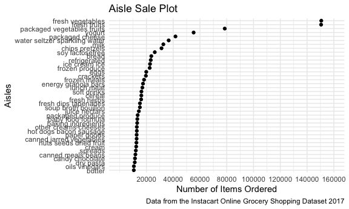

p8105\_hw3\_ly2565
================
Lin Yang
10/17/2021

``` r
library(tidyverse)
```

    ## ── Attaching packages ─────────────────────────────────────── tidyverse 1.3.1 ──

    ## ✓ ggplot2 3.3.5     ✓ purrr   0.3.4
    ## ✓ tibble  3.1.3     ✓ dplyr   1.0.7
    ## ✓ tidyr   1.1.3     ✓ stringr 1.4.0
    ## ✓ readr   2.0.1     ✓ forcats 0.5.1

    ## ── Conflicts ────────────────────────────────────────── tidyverse_conflicts() ──
    ## x dplyr::filter() masks stats::filter()
    ## x dplyr::lag()    masks stats::lag()

``` r
knitr::opts_chunk$set(
  fig.width = 6,
  fig.asp = .6,
  out.width = "90%"
)

theme_set(theme_minimal() + theme(legend.position = "bottom"))

options(
  ggplot2.continuous.colour = "viridis",
  ggplot2.continuous.fill = "viridis"
)

scale_colour_discrete = scale_colour_viridis_d
scale_fill_discrete = scale_fill_viridis_d
```

# Problem 1

## Load the instacart data.

``` r
library(p8105.datasets)
data("instacart")
instacart
```

    ## # A tibble: 1,384,617 × 15
    ##    order_id product_id add_to_cart_order reordered user_id eval_set order_number
    ##       <int>      <int>             <int>     <int>   <int> <chr>           <int>
    ##  1        1      49302                 1         1  112108 train               4
    ##  2        1      11109                 2         1  112108 train               4
    ##  3        1      10246                 3         0  112108 train               4
    ##  4        1      49683                 4         0  112108 train               4
    ##  5        1      43633                 5         1  112108 train               4
    ##  6        1      13176                 6         0  112108 train               4
    ##  7        1      47209                 7         0  112108 train               4
    ##  8        1      22035                 8         1  112108 train               4
    ##  9       36      39612                 1         0   79431 train              23
    ## 10       36      19660                 2         1   79431 train              23
    ## # … with 1,384,607 more rows, and 8 more variables: order_dow <int>,
    ## #   order_hour_of_day <int>, days_since_prior_order <int>, product_name <chr>,
    ## #   aisle_id <int>, department_id <int>, aisle <chr>, department <chr>

-   The data set has 1384617 rows and 15 columns with variables:
    order\_id, product\_id, add\_to\_cart\_order, reordered, user\_id,
    eval\_set, order\_number, order\_dow, order\_hour\_of\_day,
    days\_since\_prior\_order, product\_name, aisle\_id, department\_id,
    aisle, department.

## Some questions related to this data set.

How many aisles are there, and which aisles are the most items ordered
from:

``` r
aisle_count = 
  instacart %>% 
  select(aisle) %>% 
  n_distinct()
aisle_count
```

    ## [1] 134

``` r
aisle_most = 
  instacart %>% 
  group_by(aisle) %>% 
  summarize(n_obs = n()) %>% 
  mutate(aisle_rank = min_rank(desc(n_obs))) %>% 
  filter(aisle_rank < 3)
aisle_most
```

    ## # A tibble: 2 × 3
    ##   aisle             n_obs aisle_rank
    ##   <chr>             <int>      <int>
    ## 1 fresh fruits     150473          2
    ## 2 fresh vegetables 150609          1

-   There are 134 aisles in total, and the aisles that the most items
    are ordered from are fresh fruits, fresh vegetables.

Make a plot that shows the number of items ordered in each aisle,
limiting this to aisles with more than 10000 items ordered:

``` r
instacart %>% 
  group_by(aisle) %>% 
  summarize(n_obs = n()) %>% 
  filter(n_obs > 10000) %>% 
  mutate(aisle = fct_reorder(factor(aisle), n_obs)) %>% 
  ggplot(aes(x = n_obs, y = aisle)) +
  geom_point() +
  labs(
    title = "Number of Items Ordered from Aisles with over 10000 Items",
    x = "Number of Items",
    y = "Aisles",
    caption = "Data from the Instacart Online Grocery Shopping Dataset 2017")
```



Make a table showing the three most popular items in each of the aisles
“baking ingredients”, “dog food care”, and “packaged vegetables fruits”:

``` r
instacart %>% 
  filter(aisle == c("baking ingredients", "dog food care", "packaged vegetables fruits")) %>% 
  group_by(aisle, product_name) %>% 
  summarize(n_items = n()) %>% 
  mutate(product_rank = min_rank(desc(n_items))) %>% 
  filter(product_rank < 4) %>% 
  group_by(aisle) %>% 
  arrange(-n_items) %>% 
  select(-product_rank) %>% 
  knitr::kable()
```

    ## `summarise()` has grouped output by 'aisle'. You can override using the `.groups` argument.

| aisle                      | product\_name                                   | n\_items |
|:---------------------------|:------------------------------------------------|---------:|
| packaged vegetables fruits | Organic Baby Spinach                            |     3324 |
| packaged vegetables fruits | Organic Raspberries                             |     1920 |
| packaged vegetables fruits | Organic Blueberries                             |     1692 |
| baking ingredients         | Light Brown Sugar                               |      157 |
| baking ingredients         | Pure Baking Soda                                |      140 |
| baking ingredients         | Organic Vanilla Extract                         |      122 |
| dog food care              | Organix Grain Free Chicken & Vegetable Dog Food |       14 |
| dog food care              | Organix Chicken & Brown Rice Recipe             |       13 |
| dog food care              | Original Dry Dog                                |        9 |

Make a table showing the mean hour of the day at which Pink Lady Apples
and Coffee Ice Cream are ordered on each day of the week:

``` r
mean_hour_dow =
  instacart %>% 
  filter(product_name == c("Pink Lady Apples", "Coffee Ice Cream")) %>% 
  group_by(product_name, order_dow) %>% 
  summarize(mean_hour = mean(order_hour_of_day)) %>% 
  pivot_wider(
    names_from = order_dow,
    values_from = mean_hour
  )  
```

    ## Warning in product_name == c("Pink Lady Apples", "Coffee Ice Cream"): longer
    ## object length is not a multiple of shorter object length

    ## `summarise()` has grouped output by 'product_name'. You can override using the `.groups` argument.

``` r
colnames(mean_hour_dow) = c("", "Sun", "Mon", "Tue", "Wed", "Thu", "Fri", "Sat")
mean_hour_dow %>% 
  knitr::kable()
```

|                  |      Sun |      Mon |      Tue |     Wed |      Thu |      Fri |      Sat |
|:-----------------|---------:|---------:|---------:|--------:|---------:|---------:|---------:|
| Coffee Ice Cream | 13.22222 | 15.00000 | 15.33333 | 15.4000 | 15.16667 | 10.33333 | 12.35294 |
| Pink Lady Apples | 12.25000 | 11.67857 | 12.00000 | 13.9375 | 11.90909 | 13.86957 | 11.55556 |
