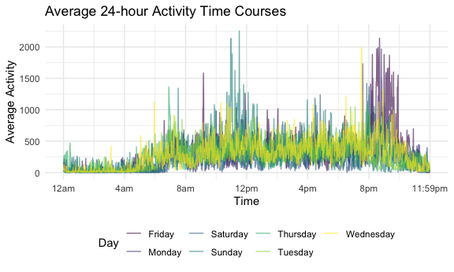

p8105\_hw3\_ly2565
================
Lin Yang
10/17/2021

# Problem 1

## Load the instacart data.

``` r
data("instacart")
instacart
```

    ## # A tibble: 1,384,617 × 15
    ##    order_id product_id add_to_cart_order reordered user_id eval_set order_number
    ##       <int>      <int>             <int>     <int>   <int> <chr>           <int>
    ##  1        1      49302                 1         1  112108 train               4
    ##  2        1      11109                 2         1  112108 train               4
    ##  3        1      10246                 3         0  112108 train               4
    ##  4        1      49683                 4         0  112108 train               4
    ##  5        1      43633                 5         1  112108 train               4
    ##  6        1      13176                 6         0  112108 train               4
    ##  7        1      47209                 7         0  112108 train               4
    ##  8        1      22035                 8         1  112108 train               4
    ##  9       36      39612                 1         0   79431 train              23
    ## 10       36      19660                 2         1   79431 train              23
    ## # … with 1,384,607 more rows, and 8 more variables: order_dow <int>,
    ## #   order_hour_of_day <int>, days_since_prior_order <int>, product_name <chr>,
    ## #   aisle_id <int>, department_id <int>, aisle <chr>, department <chr>

-   The data set has 1384617 rows and 15 columns with variables:
    order\_id, product\_id, add\_to\_cart\_order, reordered, user\_id,
    eval\_set, order\_number, order\_dow, order\_hour\_of\_day,
    days\_since\_prior\_order, product\_name, aisle\_id, department\_id,
    aisle, department.

## Some questions related to this data set.

How many aisles are there, and which aisles are the most items ordered
from:

``` r
aisle_count = 
  instacart %>% 
  select(aisle) %>% 
  n_distinct()
aisle_count
```

    ## [1] 134

``` r
aisle_most = 
  instacart %>% 
  group_by(aisle) %>% 
  summarize(n_obs = n()) %>% 
  mutate(aisle_rank = min_rank(desc(n_obs))) %>% 
  filter(aisle_rank < 3)
aisle_most
```

    ## # A tibble: 2 × 3
    ##   aisle             n_obs aisle_rank
    ##   <chr>             <int>      <int>
    ## 1 fresh fruits     150473          2
    ## 2 fresh vegetables 150609          1

-   There are 134 aisles in total, and the aisles that the most items
    are ordered from are fresh fruits, fresh vegetables.

Make a plot that shows the number of items ordered in each aisle,
limiting this to aisles with more than 10000 items ordered:

``` r
instacart %>% 
  group_by(aisle) %>% 
  summarize(n_obs = n()) %>% 
  filter(n_obs > 10000) %>% 
  mutate(aisle = fct_reorder(factor(aisle), n_obs)) %>% 
  ggplot(aes(x = n_obs, y = aisle)) +
  geom_point() +
  labs(
    title = "Number of Items Ordered from Aisles with over 10000 Items",
    x = "Number of Items",
    y = "Aisles",
    caption = "Data from the Instacart Online Grocery Shopping Dataset 2017")
```


Make a table showing the three most popular items in each of the aisles
“baking ingredients”, “dog food care”, and “packaged vegetables fruits”:

``` r
instacart %>% 
  filter(aisle == c("baking ingredients", "dog food care", "packaged vegetables fruits")) %>% 
  group_by(aisle, product_name) %>% 
  summarize(n_items = n()) %>% 
  mutate(product_rank = min_rank(desc(n_items))) %>% 
  filter(product_rank < 4) %>% 
  group_by(aisle) %>% 
  arrange(-n_items) %>% 
  select(-product_rank) %>% 
  knitr::kable()
```

    ## `summarise()` has grouped output by 'aisle'. You can override using the `.groups` argument.

| aisle                      | product\_name                                   | n\_items |
|:---------------------------|:------------------------------------------------|---------:|
| packaged vegetables fruits | Organic Baby Spinach                            |     3324 |
| packaged vegetables fruits | Organic Raspberries                             |     1920 |
| packaged vegetables fruits | Organic Blueberries                             |     1692 |
| baking ingredients         | Light Brown Sugar                               |      157 |
| baking ingredients         | Pure Baking Soda                                |      140 |
| baking ingredients         | Organic Vanilla Extract                         |      122 |
| dog food care              | Organix Grain Free Chicken & Vegetable Dog Food |       14 |
| dog food care              | Organix Chicken & Brown Rice Recipe             |       13 |
| dog food care              | Original Dry Dog                                |        9 |

Make a table showing the mean hour of the day at which Pink Lady Apples
and Coffee Ice Cream are ordered on each day of the week:

``` r
mean_hour_dow =
  instacart %>% 
  filter(product_name == c("Pink Lady Apples", "Coffee Ice Cream")) %>% 
  group_by(product_name, order_dow) %>% 
  summarize(mean_hour = mean(order_hour_of_day)) %>% 
  pivot_wider(
    names_from = order_dow,
    values_from = mean_hour
  )  
```

    ## Warning in product_name == c("Pink Lady Apples", "Coffee Ice Cream"): longer
    ## object length is not a multiple of shorter object length

    ## `summarise()` has grouped output by 'product_name'. You can override using the `.groups` argument.

``` r
colnames(mean_hour_dow) = c("", "Sun", "Mon", "Tue", "Wed", "Thu", "Fri", "Sat")
mean_hour_dow %>% 
  knitr::kable()
```

|                  |      Sun |      Mon |      Tue |     Wed |      Thu |      Fri |      Sat |
|:-----------------|---------:|---------:|---------:|--------:|---------:|---------:|---------:|
| Coffee Ice Cream | 13.22222 | 15.00000 | 15.33333 | 15.4000 | 15.16667 | 10.33333 | 12.35294 |
| Pink Lady Apples | 12.25000 | 11.67857 | 12.00000 | 13.9375 | 11.90909 | 13.86957 | 11.55556 |

# Problem 2

## Load the BRFSS data set.

``` r
data("brfss_smart2010")
brfss_df = 
  brfss_smart2010 %>% 
  janitor::clean_names() %>% 
  separate(locationdesc, into = c('state', 'location'), sep = "-") %>%
  select(-state) %>%
  rename(state = locationabbr) %>% 
  filter(topic == "Overall Health") %>% 
  mutate(response = factor(response, levels = c("Poor", "Fair", "Good", "Very good", "Excellent"))) %>% 
  arrange(response)
```

    ## Warning: Expected 2 pieces. Additional pieces discarded in 500 rows [4211, 4212,
    ## 4213, 4214, 4215, 4216, 4217, 4218, 4219, 4220, 4221, 4222, 4223, 4224, 4225,
    ## 4226, 4227, 4228, 4229, 4230, ...].

``` r
brfss_df
```

    ## # A tibble: 10,625 × 23
    ##     year state location  class  topic  question  response sample_size data_value
    ##    <int> <chr> <chr>     <chr>  <chr>  <chr>     <fct>          <int>      <dbl>
    ##  1  2010 AL    " Jeffer… Healt… Overa… How is y… Poor              45        5.5
    ##  2  2010 AL    " Mobile… Healt… Overa… How is y… Poor              66        6.4
    ##  3  2010 AL    " Tuscal… Healt… Overa… How is y… Poor              35        4.2
    ##  4  2010 AZ    " Marico… Healt… Overa… How is y… Poor              62        3.5
    ##  5  2010 AZ    " Pima C… Healt… Overa… How is y… Poor              49        5.7
    ##  6  2010 AZ    " Pinal … Healt… Overa… How is y… Poor              30        4  
    ##  7  2010 AR    " Benton… Healt… Overa… How is y… Poor              21        3  
    ##  8  2010 AR    " Pulask… Healt… Overa… How is y… Poor              36        3.8
    ##  9  2010 AR    " Washin… Healt… Overa… How is y… Poor              16        2.4
    ## 10  2010 CA    " Alamed… Healt… Overa… How is y… Poor              23        2.4
    ## # … with 10,615 more rows, and 14 more variables: confidence_limit_low <dbl>,
    ## #   confidence_limit_high <dbl>, display_order <int>, data_value_unit <chr>,
    ## #   data_value_type <chr>, data_value_footnote_symbol <chr>,
    ## #   data_value_footnote <chr>, data_source <chr>, class_id <chr>,
    ## #   topic_id <chr>, location_id <chr>, question_id <chr>, respid <chr>,
    ## #   geo_location <chr>

## Some questions related to the data set.

In 2002, which states were observed at 7 or more locations? What about
in 2010:

``` r
brfss_2002 = 
  brfss_df %>% 
  filter(year == 2002) %>% 
  select(state, location) %>% 
  group_by(state) %>% 
  summarize(n_locations = n()) %>% 
  filter(n_locations >= 7)

brfss_2010 = 
  brfss_df %>% 
  filter(year == 2010) %>% 
  select(state, location) %>% 
  group_by(state) %>% 
  summarize(n_locations = n()) %>% 
  filter(n_locations >= 7)
```

In 2002, the states observed at 7 or more locations were AZ, CO, CT, DE,
FL, GA, HI, ID, IL, IN, KS, LA, MA, MD, ME, MI, MN, MO, NC, NE, NH, NJ,
NV, NY, OH, OK, OR, PA, RI, SC, SD, TN, TX, UT, VT, WA. In 2010, they
were AL, AR, AZ, CA, CO, CT, DE, FL, GA, HI, IA, ID, IL, IN, KS, LA, MA,
MD, ME, MI, MN, MO, MS, MT, NC, ND, NE, NH, NJ, NM, NV, NY, OH, OK, OR,
PA, RI, SC, SD, TN, TX, UT, VT, WA, WY.

Construct a dataset that is limited to Excellent responses, and
contains, year, state, and a variable that averages the data\_value
across locations within a state:

``` r
excellent_df = 
  brfss_df %>% 
  filter(response == "Excellent") %>% 
  group_by(state, year) %>% 
  summarize(data_value_mean = mean(data_value, na.rm = TRUE))
```

    ## `summarise()` has grouped output by 'state'. You can override using the `.groups` argument.

``` r
excellent_df
```

    ## # A tibble: 443 × 3
    ## # Groups:   state [51]
    ##    state  year data_value_mean
    ##    <chr> <int>           <dbl>
    ##  1 AK     2002            27.9
    ##  2 AK     2003            24.8
    ##  3 AK     2004            23.0
    ##  4 AK     2005            23.8
    ##  5 AK     2007            23.5
    ##  6 AK     2008            20.6
    ##  7 AK     2009            23.2
    ##  8 AL     2002            18.5
    ##  9 AL     2003            19.5
    ## 10 AL     2004            20  
    ## # … with 433 more rows

-   The excellent response data set contains average data values of 51
    states (including DC) from 2002 to 2010.

Make a “spaghetti” plot of this average value over time within a state:

``` r
## need more aes and comments
excellent_df %>% 
  ggplot(aes(x = year, y = data_value_mean, group = state, color = state)) +
  geom_line() +
  labs(
    title = "Average Data Value Over Time Within A State",
    x = "Year",
    y = "Average Data Value"
  )
```


Make a two-panel plot showing, for the years 2006, and 2010,
distribution of data\_value for responses (“Poor” to “Excellent”) among
locations in NY State:

``` r
ny_2006 = 
  brfss_df %>% 
  filter(year == 2006, state == "NY") %>% 
  ggplot(aes(x = response, y = data_value)) +
  geom_boxplot() +
  labs(
    title = "Distribution of Data Value in 2006",
    x = "Response",
    y = "Data Value"
  )

ny_2010 = 
  brfss_df %>% 
  filter(year == 2010, state == "NY") %>% 
  ggplot(aes(x = response, y = data_value)) +
  geom_boxplot() +
  labs(
    title = "Distribution of Data Value in 2010",
    x = "Response",
    y = "Data Value"
  )

ny_2006 + ny_2010
```


``` r
ny_2006 + ny_2010
```


\* From the plot, we can see that data values for positive
responses(excellent, very good, good) were greater than those for fair
and poor responses in both 2006 and 2010.

# Problem 3

## Load and tidy the accelerometer data set.

``` r
accelerometer_df = 
  read_csv(file = "data/accel_data.csv") %>% 
  janitor::clean_names() %>% 
  mutate(
    weekday_or_end = ifelse(day %in% c("Saturday", "Sunday"), "Weekend", "Weekday")) %>% 
    select(day_id, week, day, weekday_or_end, everything()) %>% 
  pivot_longer(
    activity_1:activity_1440,
    names_to = "minute",
    names_prefix = "activity_",
    values_to = "activity_count"
  ) %>% 
  mutate(minute = as.numeric(minute))
```

    ## Rows: 35 Columns: 1443

    ## ── Column specification ────────────────────────────────────────────────────────
    ## Delimiter: ","
    ## chr    (1): day
    ## dbl (1442): week, day_id, activity.1, activity.2, activity.3, activity.4, ac...

    ## 
    ## ℹ Use `spec()` to retrieve the full column specification for this data.
    ## ℹ Specify the column types or set `show_col_types = FALSE` to quiet this message.

``` r
accelerometer_df
```

    ## # A tibble: 50,400 × 6
    ##    day_id  week day    weekday_or_end minute activity_count
    ##     <dbl> <dbl> <chr>  <chr>           <dbl>          <dbl>
    ##  1      1     1 Friday Weekday             1           88.4
    ##  2      1     1 Friday Weekday             2           82.2
    ##  3      1     1 Friday Weekday             3           64.4
    ##  4      1     1 Friday Weekday             4           70.0
    ##  5      1     1 Friday Weekday             5           75.0
    ##  6      1     1 Friday Weekday             6           66.3
    ##  7      1     1 Friday Weekday             7           53.8
    ##  8      1     1 Friday Weekday             8           47.8
    ##  9      1     1 Friday Weekday             9           55.5
    ## 10      1     1 Friday Weekday            10           43.0
    ## # … with 50,390 more rows

-   The resulting data set has 50400 observations of 6 variables:
    day\_id, week, day, weekday\_or\_end, minute, activity\_count. In
    the `minute` column, `1` means the first minute starting at
    midnight, `2` means the second minute and so on. The values in the
    `activity_count` column are the activity counts for each minute.

## Aggregate activity counts for each day.

``` r
accelerometer_df %>% 
  group_by(week, day) %>% 
  summarize(activity_total = sum(activity_count)) %>% 
  pivot_wider(
    names_from = day,
    values_from = activity_total
  ) %>% 
  select(week, Monday, Tuesday, Wednesday, Thursday, Friday, everything()) %>% 
  knitr::kable()
```

    ## `summarise()` has grouped output by 'week'. You can override using the `.groups` argument.

| week |    Monday |  Tuesday | Wednesday | Thursday |   Friday | Saturday | Sunday |
|-----:|----------:|---------:|----------:|---------:|---------:|---------:|-------:|
|    1 |  78828.07 | 307094.2 |    340115 | 355923.6 | 480542.6 |   376254 | 631105 |
|    2 | 295431.00 | 423245.0 |    440962 | 474048.0 | 568839.0 |   607175 | 422018 |
|    3 | 685910.00 | 381507.0 |    468869 | 371230.0 | 467420.0 |   382928 | 467052 |
|    4 | 409450.00 | 319568.0 |    434460 | 340291.0 | 154049.0 |     1440 | 260617 |
|    5 | 389080.00 | 367824.0 |    445366 | 549658.0 | 620860.0 |     1440 | 138421 |

-   It seems total activities increased during weekdays, but the trend
    is not strictly increasing. In addition, the total activities on
    Saturday in week 4 and 5 dropped significantly, which may need us to
    pay attention to.

## Make a plot showing the 24-hour activity time courses for each day.

``` r
accelerometer_df %>% 
  ggplot(aes(x = minute, y = activity_count, color = day, group = day_id)) +
  geom_line(alpha = 0.6) + 
  labs(
    title = "24-hour Activity Counts",
    x = "Time",
    y = "Activity Counts"
  ) +
  scale_x_continuous(
    breaks = c(0, 240, 480, 720, 960, 1200, 1440), 
    labels = c("12am.", "4am", "8am", "12pm", "4pm", "8pm", "11:59pm"),
    limits = c(0, 1440)
  )
```


\* From the plot, we can see that activity counts tend to be higher in 3
periods of time on each day: 6am-12pm, 4pm-6pm, and 8pm-10pm(especially
on Wed and Fri); activity counts tend to be lower from 10pm-6pm each day
which may be the sleeping period.
